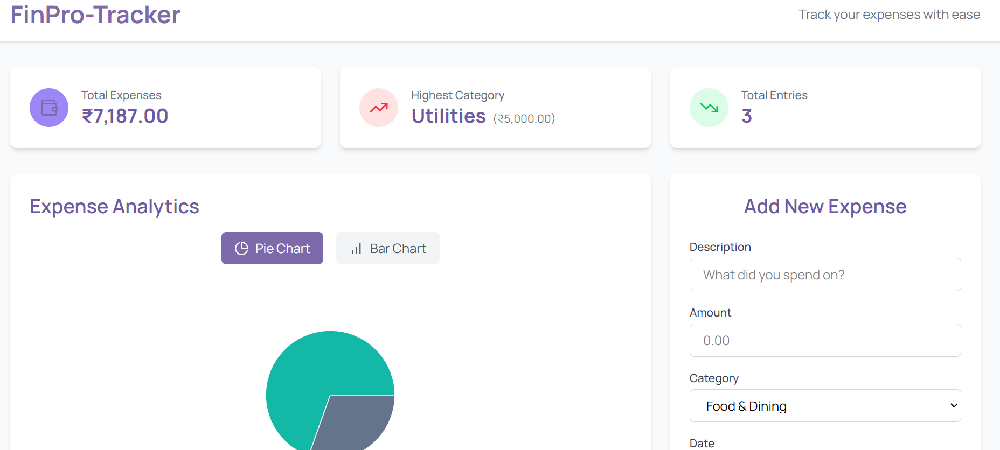

# FinPro-Tracker


> **Track your expenses with ease.**

FinPro-Tracker is a sleek and simple expense tracking web application that helps users record, analyze, and visualize their daily spending habits.

---

## 📸 Screenshot



---

## ✨ Features

- **Total Expenses**: Displays the cumulative amount spent.
- **Highest Category**: Highlights the category where the most spending occurred.
- **Total Entries**: Shows the number of expense entries added.
- **Expense Analytics**: Visualizes expenses using Pie Chart and Bar Chart views.
- **Add New Expense**: Easy-to-use form to add description, amount, category, and date.
- **Category-wise Tracking**: Sort and track expenses across multiple categories.
- **Responsive Design**: Works beautifully on both desktop and mobile devices.

---

## 🛠 Built With

- **Frontend**: React.js
- **UI Library**: Tailwind CSS
- **Charts**: Recharts.
- **State Management**: React Hooks (`useState`, `useEffect`)

---

## 🚀 Getting Started

### Prerequisites

- Node.js and npm installed
- Basic knowledge of React

### Installation

1. Clone the repository:
   ```bash
   git clone https://github.com/your-username/finpro-tracker.git
   ```
2. Navigate into the project folder:
   ```bash
   cd finpro-tracker
   ```
3. Install dependencies:
   ```bash
   npm install
   ```
4. Start the development server:
   ```bash
   npm run dev
   ```
5. Visit the app at:

   ```
   https://expense-tracker-pro-371151.netlify.app/
   ```

---

## 📂 Project Structure

```bash
finpro-tracker/
├── public/
│   └── screenshots/
│       └── finpro-tracker-screenshot.png
├── src/
│   ├── components/
│   │   ├── ExpenseForm.jsx
│   │   ├── ExpenseList.jsx
│   │   ├── ExpenseChart.jsx
│   ├── App.jsx
│   └── index.js
├── tailwind.config.js
├── package.json
└── README.md
```

---

## 📈 Future Improvements

- User Authentication (Sign In / Sign Up)
- Cloud-based Storage (e.g., Firebase integration)
- Filters by Date Range
- Export expenses to CSV
- Dark Mode Support

---

## 🙌 Contribution

Contributions, issues, and feature requests are welcome!

Feel free to check the [issues page](https://github.com/SurajDas2219/FinPro_Tracker/issues).

---

## 📄 License

This project is licensed under the [MIT License](LICENSE).

---

# 🚀 Let's manage expenses like a Pro with FinPro-Tracker!
